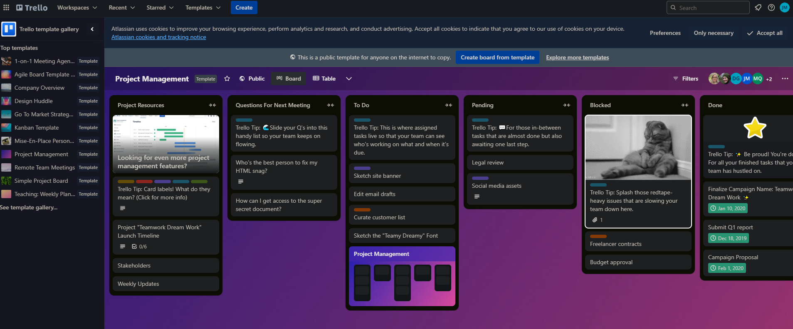

This could be the File Structure:



```
src/
  components/
    AppContainer.jsx
    Header/
      Header.jsx
    Board/
      BoardContainer.jsx
      List.jsx
      Card.jsx
      CardLabel.jsx
      Checklist.jsx
      CardTooltip.jsx
    Sidebar/
      Sidebar.jsx
    Footer/
      Footer.jsx
  styles/
    tailwind.config.js
    board.css
  utils/
    dataFetching.js
    formatDate.js
  assets/
    icons/
    images/

```

## Resources
### Icon
* Arrow Icon: [Flaticon logo](https://www.flaticon.com/)
